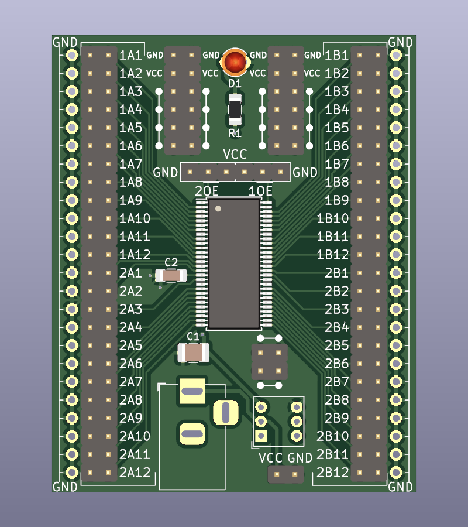
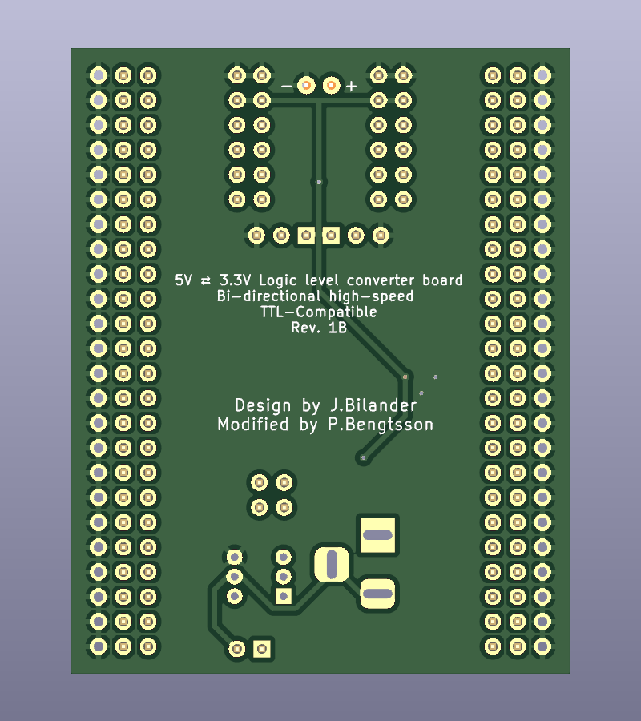
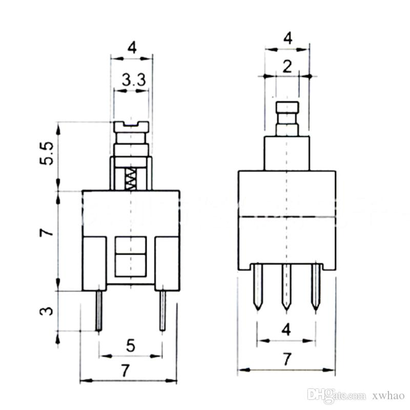
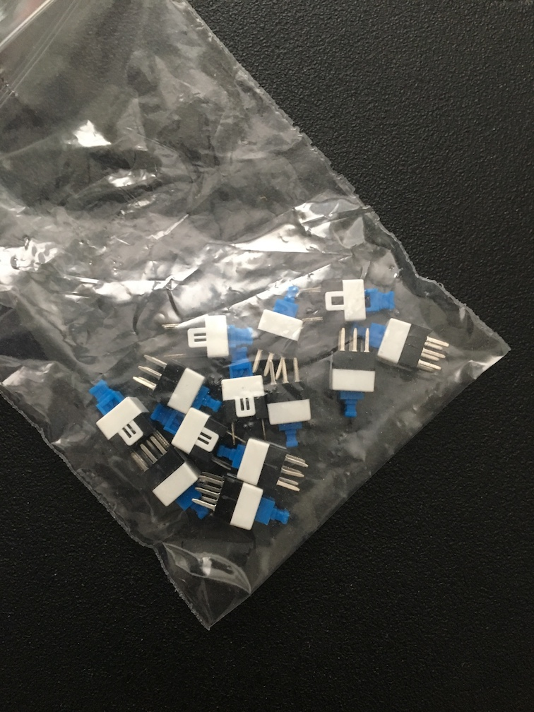
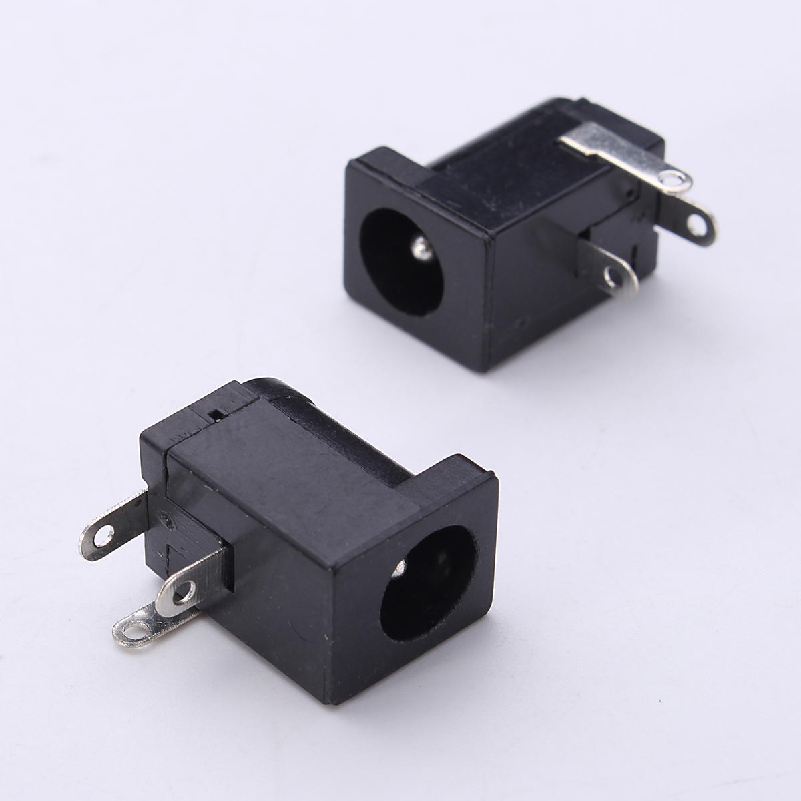
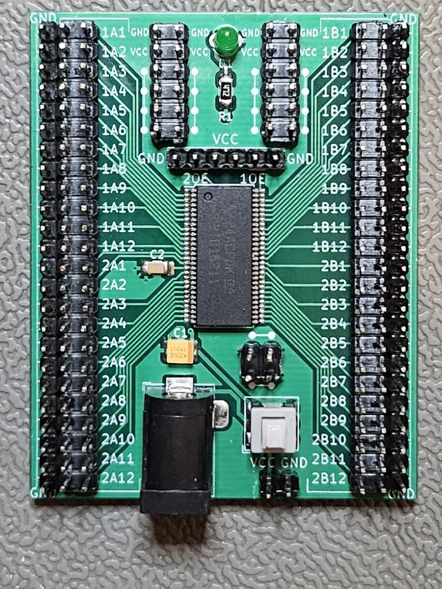

# Logic level converter board (SSOP)
A bi-directional high-speed TTL-Compatible level shifter board 5V ⇄ 3V3 for tinkering

This fork replaces the currently hard to find TSSOP package with the more available SSOP package.  
Only a few small adjustments had to be made to make room for the larger chip.
***

PART  | Value       | Description
---| ---------------| -------
D1 | 2.54 mm pin pitch | LED Diode (optional Power on/off indicator)
R1 | 100-330 Ohm | 1206 (populate if D1, calculate suitable resistor value to use with D1)
C1 | 10-100 uF   | 1210
C2 | 0.1 uF      | 1206
U1 | SN74CBTD16211DL https://www.ti.com/lit/ds/symlink/sn74cbtd16211.pdf| SSOP-56_7.5x18.5mm_P0.635mm
 | Pushbutton switch SW_7x7x12mm_DPDT
 | Barrel Jack 5.5x2.1mm
 | Power +5V center pin positive or via pinheader (verify polarity before connecting)
 | 2.54 mm jumpers to enable/disable /1OE (first 12-bits) and /2OE (second 12-bits), either enable via jumper to GND or disable via VCC.
 | 2.54 mm jumpers to disable unused inputs via jumper to GND.
 | A lot of 2.54mm pinheader strips. 

Happy Tinkerin'
